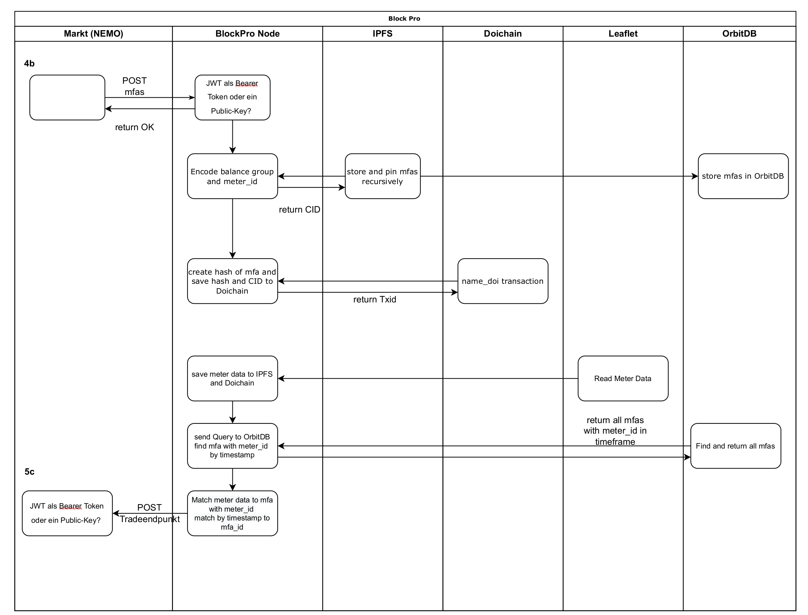

<h1 align="center">Authentication API with JWT Token</h1>


## Table of Contents
- [Background](#background)
- [Install](#install)
- [Usage](#usage)
- [Contributing](#contributing)
- [License](#license)

## Background

Interface for BlockPro market place. An offer is sent to BlockPro via Rest API and stored in the Doichain Blockchain. Data from the offer like meter_id, date and amount of electricity ordered are also stored in OrbitDB. 

If the production and consumption of the ordered electricity has taken place, a matching between meter data and the order is sent back to the market place.

<p align="center">
  
</p>

## Install
1. Git clone this repo 
2. Run ```npm i``` in root directory
3. Start a mongodb instance 
4. Run ```npm run dev```
5. Use postman to test requests: 

Create a user with a POST request: ```http://localhost:4002/register```
with a JSON body for example:
```json
 {
     "first_name": "MyName",
     "last_name": "MyLast",
     "email": "my@last.com",
     "password": "11223344"
 }
 ```

 Login with a POST request: ```http://localhost:4002/login```
 with JSON body:
 ```json
  {
     "email": "my@last.com",
     "password": "11223344"
 }
 ```
 
 Then copy the token from the login response and 
 Enter with a GET request: ```http://localhost:4002/login```
 with the Header:
 x-access-token as key and the copied token as a value

 ## Contributing

<a href="https://github.com/stallingerl/jwt-project/graphs/contributors">
  
</a>

## License

[](https://opensource.org/licenses/MIT)

[MIT © 2022 Lena Stallinger.](./LICENSE.txt)